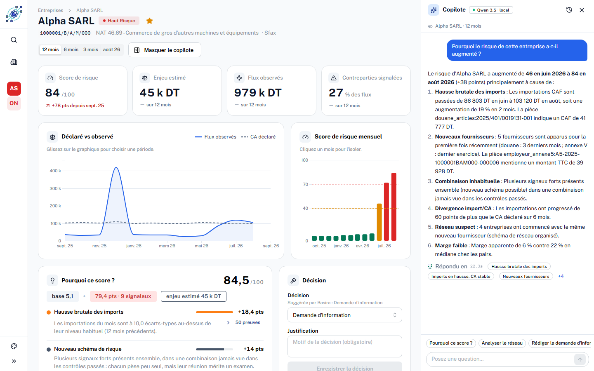
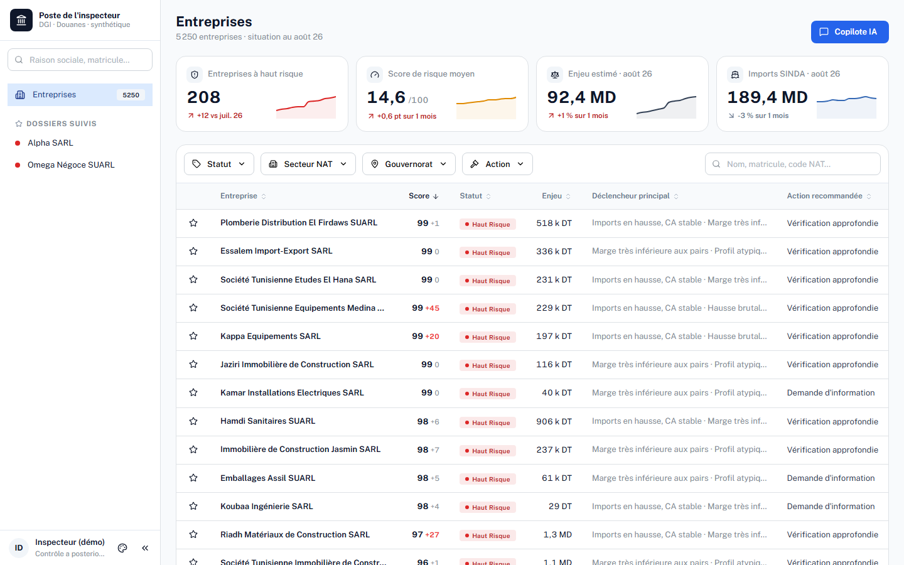
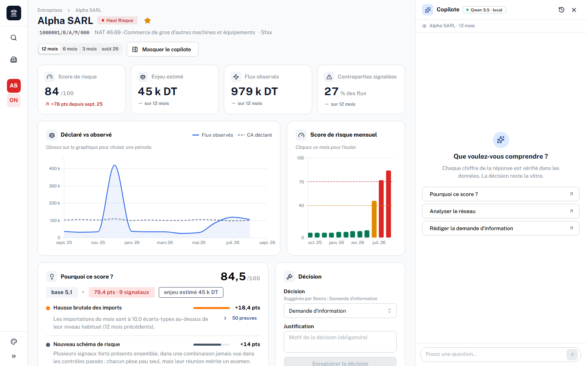
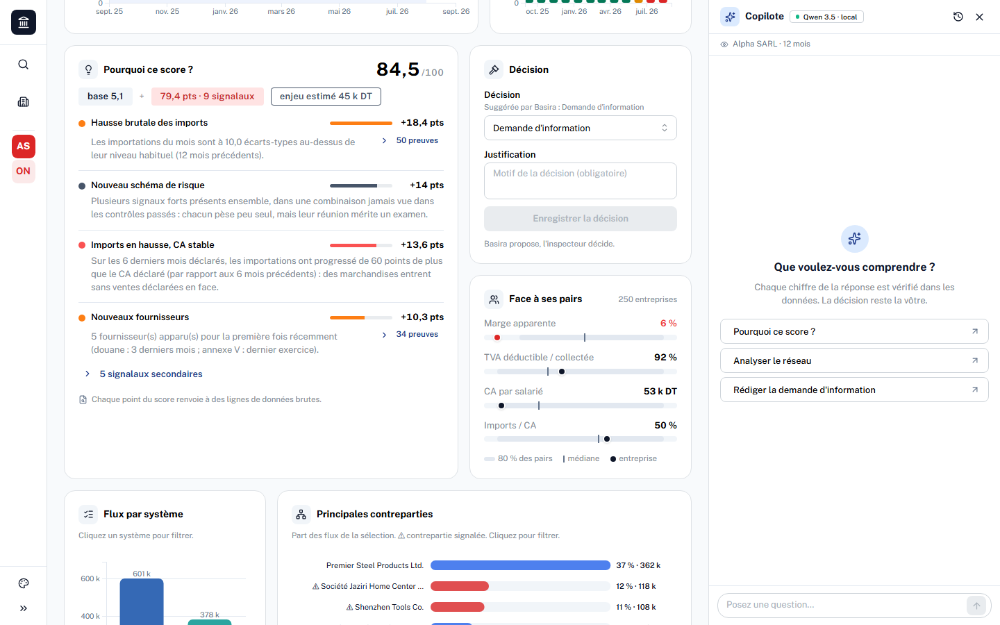
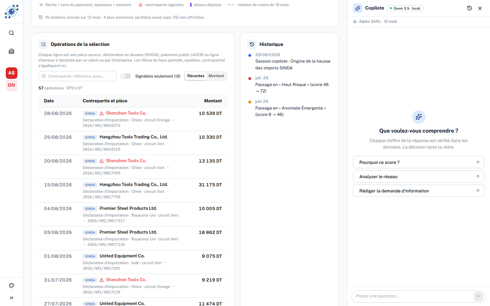
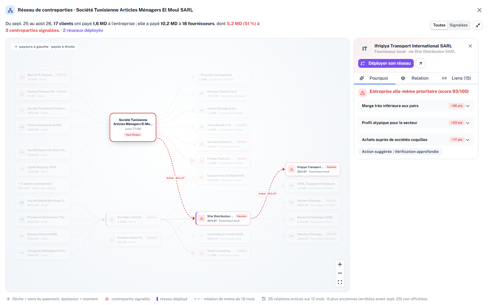
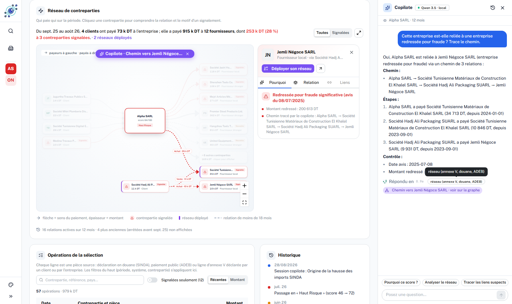
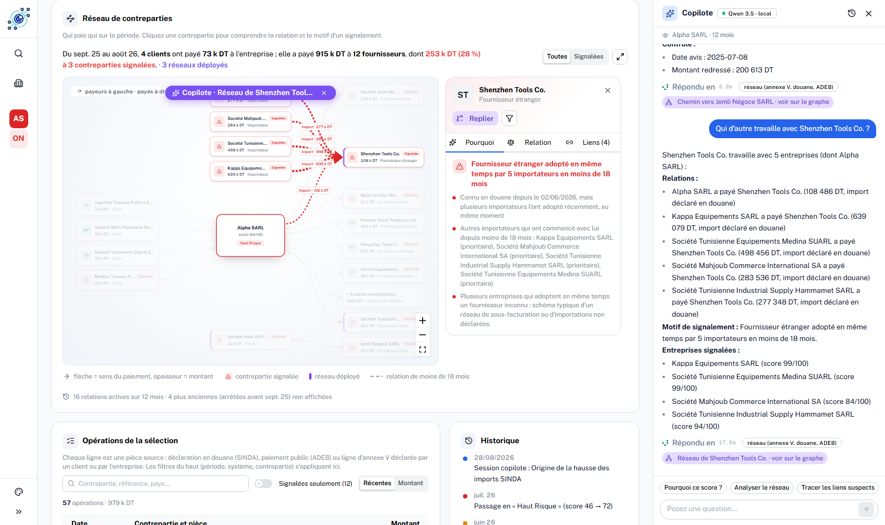
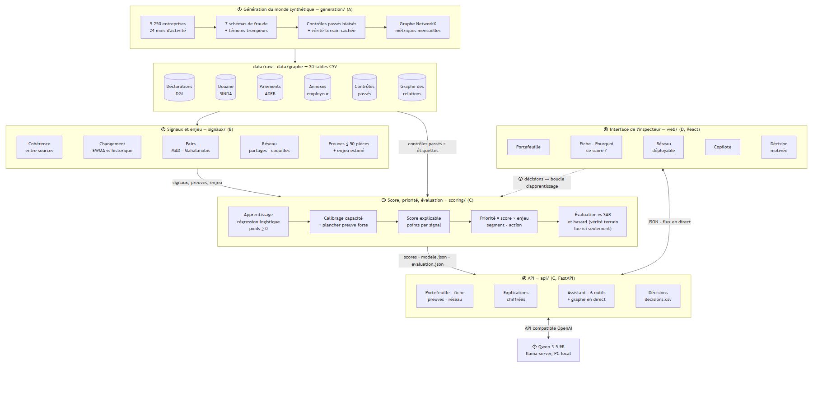
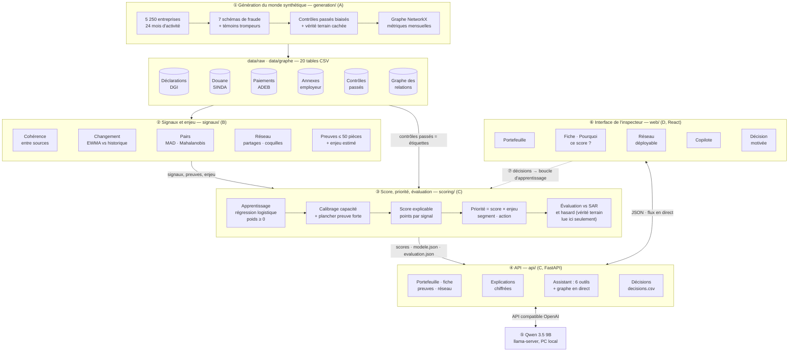

<p align="center"></p>

# Basira — le risque de conformité des entreprises, expliqué

> **Hackathon national « IA & Finances publiques »** (Esprit School of Business, 25–26 septembre 2026)
> Défi principal **T20 — Risk scoring dynamique de la conformité des entreprises** · défi complémentaire **T7 — croisement des
> données fiscales, douanières et financières**.

Basira aide l'inspecteur des impôts à choisir **quels dossiers ouvrir en premier**, parmi des milliers d'entreprises. Chaque mois,
Basira recoupe ce que l'entreprise **déclare** avec ce que **les autres administrations observent** (douane, paiements publics,
déclarations de ses clients), attribue un score de risque **explicable point par point**, estime l'enjeu en dinars et propose une
action. **L'inspecteur garde la décision.**



**Sommaire** · [Problème](#1-le-problème) · [Solution avec l'inspecteur](#2-la-solution-concrètement-une-matinée-avec-linspecteur) ·
[Données](#3-comment-nous-avons-tiré-parti-des-données) · [Valeur ajoutée de l'IA](#4-la-valeur-ajoutée-de-lia) ·
[Réalisation](#5-réalisation) · [Pipeline technique](#6-pipeline-technique) · [Lancer le projet](#7-lancer-le-projet) ·
[Limites](#8-limites-et-perspectives)

---

## 1. Le problème

- **Les données existent, mais en silos.** Déclarations fiscales mensuelles (DGI), déclarations en douane (SINDA), paiements de l'État
  aux entreprises (ADEB), annexes de l'employeur où chaque entreprise déclare ce qu'elle a payé à ses fournisseurs : chaque source est
  lue séparément. Or la fraude se voit surtout **entre** les sources : une entreprise qui importe trois fois plus sans que son chiffre
  d'affaires bouge, une société payée par l'État qui ne déclare pas ces recettes, des clients qui déclarent avoir payé un fournisseur
  qui, lui, ne déclare presque rien.
- **La sélection des contrôles est statique.** Des règles fixes (taille, secteur « classique », retards de dépôt) favorisent les grandes
  entreprises et ne voient pas les nouveaux schémas. La couverture est faible : de l'ordre de 2,5 % des contribuables contrôlés.
- **Un score seul ne suffit pas.** Un inspecteur ne peut pas ouvrir un contrôle sur la foi d'un nombre : il lui faut les **raisons**,
  chiffrées, et les **pièces** qui les prouvent.

## 2. La solution, concrètement : une matinée avec l'inspecteur

| # | Ce que fait l'inspecteur | Ce que Basira lui montre |
|---|---|---|
| 1 | Il ouvre Basira en début de mois. | Le **portefeuille** des 5 250 entreprises classées par **priorité = risque × enjeu** : 208 à haut risque ce mois-ci, le déclencheur principal de chacune et l'action recommandée. Filtres par statut, secteur, gouvernorat, action ; recherche ; pagination. |
| 2 | Il ouvre la première fiche, Alpha SARL. | Score **84/100** (+78 points depuis septembre 2025), enjeu estimé **45 k DT**, la courbe « déclaré vs observé » et la **trajectoire mensuelle** du score : Alpha était en confiance jusqu'en mai, puis 46 → 72 → 84. |
| 3 | Il veut comprendre **pourquoi**. | Le panneau **« Pourquoi ce score ? »** : base 5 + chaque signal avec ses **points** et une phrase chiffrée (« les importations du mois sont à 10 écarts-types au-dessus de leur niveau habituel », « 5 fournisseurs apparus récemment »…). Un clic ouvre les **pièces sources** (lignes de déclaration en douane, d'annexe V…). Comparaison avec **250 entreprises pairs** du même secteur et de la même taille. |
| 4 | Il regarde avec qui Alpha travaille. | Le **graphe des flux d'argent** (qui paie qui, combien, depuis quand), les contreparties signalées en rouge avec la **raison** de leur signalement. « **Déployer son réseau** » étend le graphe à la contrepartie suspecte pour remonter une chaîne (ex. El Moul → Sfar Distribution → Ifriqiya Transport). |
| 5 | Il pose une question en langage naturel. | Le **copilote** (Qwen 3.5 9B hébergé en local) répond à partir des données du dossier uniquement, cite ses pièces, et peut **rédiger la lettre de demande d'information**. Tout chiffre non présent dans les données est bloqué. Il **agit sur le graphe en direct** : « Tracer les liens suspects » dessine et anime le chemin jusqu'à une entreprise redressée pour fraude ; « Qui d'autre travaille avec Shenzhen Tools Co. ? » déploie le réseau de ce fournisseur, avant même que la réponse écrite n'arrive. |
| 6 | Il décide. | Il choisit l'action (aucune, relance, demande d'information, vérification, signalement à la douane) et **justifie** sa décision, qui est journalisée. Ces décisions deviennent de **nouveaux exemples d'apprentissage** : le modèle s'améliore avec l'usage. |

Basira propose, explique et documente ; **aucune sanction n'est automatique**. À l'inverse, les entreprises sans aucun signal depuis
12 mois, avec au moins 24 mois d'historique et sans redressement passé, sont classées **CONFIANCE** : candidates à une voie de
facilitation.

## 3. Comment nous avons tiré parti des données

### 3.1 Un monde synthétique réaliste (aucune donnée réelle)

Aucune donnée confidentielle n'a été fournie ni utilisée. Nous avons généré un monde synthétique **au format réel** des documents
publics (déclaration mensuelle, cahier des charges de l'employeur, valeur en douane, ADEB) : **5 250 entreprises sur 24 mois**
(septembre 2024 → août 2026), avec des flux cohérents entre sources (ce qu'un client déclare avoir payé = ce que le fournisseur a
vendu, sauf fraude).

| Source simulée | Lignes | Ce qu'elle révèle |
|---|---:|---|
| Registre des contribuables | 5 250 | secteur (NAT), taille, gouvernorat, date de début d'activité |
| Déclarations mensuelles (TVA, CA) | 184 871 | ce que l'entreprise **déclare** |
| Douane : déclarations, articles, liquidations (SINDA) | 156 968 · 298 768 · 931 554 | ce qu'elle **importe** réellement, à quel prix, de quel fournisseur |
| Paiements publics (ADEB) | 17 925 | ce que l'**État lui a payé** |
| Annexes de l'employeur I, II, V | 13 359 · 20 131 · 70 972 | ce que **ses clients déclarent lui avoir payé** (annexe V) |
| Graphe des relations (dérivé) | 43 135 arêtes | qui paie qui : réseaux, fournisseurs partagés, sociétés coquilles |
| Contrôles passés | 276 | résultats des contrôles précédents : les **étiquettes** d'apprentissage |

Le générateur injecte **7 schémas de fraude** : minoration du CA, réseaux de fausses factures, sous-évaluation en douane, recettes
publiques non déclarées, entreprise dormante réactivée, compression de marge, sociétés coquilles. Il ajoute aussi des **témoins
trompeurs** : croissance légitime (forte hausse bien déclarée), citoyens modèles, sosies sans fraude. Les contrôles passés sont
**biaisés** comme dans la réalité (sélection par une règle statique) et leurs résultats **bruités**.

### 3.2 Les règles qui rendent l'exploitation honnête

- **Croiser au lieu de lire séparément** : 5 des 16 signaux comparent deux sources indépendantes (imports vs CA, paiements reçus des
  clients vs CA, paiements ADEB vs CA, TVA payée en douane vs TVA déduite, prix déclaré vs prix de référence en douane).
- **Comparer à soi-même et aux autres** : chaque entreprise est comparée à son propre historique (12 mois) et à ses pairs (même
  division d'activité × même taille, 30 entreprises au minimum).
- **Pas de lecture du futur** : un calcul à fin M ne lit que ce qui était disponible à cette date (déclaration de M connue en M+1,
  annexes de l'exercice N publiées en mars N+1, résultats de contrôle cités seulement après leur notification). Des tests
  automatiques vérifient qu'une donnée future ne change jamais un signal passé.
- **Tout est traçable** : chaque signal actif garde jusqu'à 50 références de pièces (`table:identifiant`) que l'interface ouvre.
- **La vérité terrain est cachée** : le fichier qui dit « qui fraude vraiment » n'est lu **que** pour mesurer les résultats, jamais
  pour apprendre ni pour fixer un seuil (un test vérifie que le calcul des signaux ne l'ouvre jamais).

## 4. La valeur ajoutée de l'IA

L'IA est placée **là où elle apporte quelque chose**, et chaque étage reste explicable :

| Étage | Technique | Pourquoi c'est mieux qu'une règle fixe |
|---|---|---|
| **Détecter** | 16 signaux statistiques en 4 lentilles : cohérence entre sources, changement (lissage exponentiel EWMA vs historique), pairs (écart robuste médiane/MAD, distance de Mahalanobis régularisée), réseau (fournisseurs partagés, coquilles, proximité d'entreprises redressées) | voit les **écarts entre administrations** et les **ruptures de comportement**, pas seulement la taille |
| **Pondérer** | Régression logistique apprise sur les contrôles passés, poids ≥ 0, calibrée sur la capacité de contrôle | l'importance de chaque signal vient des **résultats réels de contrôle**, et se réajuste avec les décisions des inspecteurs |
| **Expliquer** | Décomposition exacte du score : chaque point est attribué à un signal (somme des points = score − base) | l'inspecteur sait **pourquoi**, chiffres et pièces à l'appui ; aucune « boîte noire » |
| **Prioriser** | Priorité = score × enjeu estimé (droits éludés reconstitués à partir des écarts) | on contrôle d'abord là où **le risque et l'argent** sont les plus élevés |
| **Détecter l'inédit** | Bonus « nouveau schéma » : plusieurs signaux forts réunis alors qu'ils pèsent peu dans l'historique | ne pas ignorer une combinaison que les contrôles passés n'ont jamais vue |
| **Assister** | LLM **Qwen 3.5 9B** local, 6 outils (dossier, preuves, réseau, lettre, **liens d'une contrepartie**, **chemin vers une entreprise redressée**) + garde-fou sur les chiffres | l'inspecteur interroge le dossier en français ; **aucun chiffre inventé**, **aucune donnée ne sort** du réseau local |
| **Enquêter sur le graphe** | Le copilote choisit les outils de réseau ; l'API calcule le résultat à partir des relations déclarées et l'envoie **en flux** au graphe de l'écran | l'IA **navigue** dans le réseau (remonter une chaîne, explorer un fournisseur) et le **montre** ; elle n'invente jamais un lien : le graphe ne contient que des relations déclarées |
| **Apprendre** | Boucle : décision de l'inspecteur → exemple étiqueté → réentraînement (hors démo, validé avant mise en service) | le système s'améliore avec l'usage, sous contrôle humain |

**Ce que nous ne revendiquons pas** (voir [§5.3](#53-indicateurs-clés-métriques-de-lia)) : avec seulement 276 contrôles passés, les poids
appris ne font pas mieux que des poids égaux. La performance vient aujourd'hui du **croisement des sources** ; l'apprentissage prendra
son sens avec les décisions des inspecteurs.

## 5. Réalisation

### 5.1 Fonctionnalités

- **Portefeuille** : 4 indicateurs (entreprises à haut risque, score moyen, enjeu, imports) avec tendance sur 12 mois ; tableau trié par
  priorité, filtres (statut, secteur NAT, gouvernorat, action), recherche, pagination ; dossiers suivis.
- **Fiche entreprise** : score et variation, enjeu, flux observés, part des flux vers des contreparties signalées ; courbes « déclaré vs
  observé » et score mensuel (période au choix) ; **« Pourquoi ce score ? »** avec points, phrases chiffrées, preuves brutes et
  comparaison aux pairs ; historique des passages de segment.
- **Réseau** : graphe des flux d'argent (mise en page automatique dagre), relations nommées et chiffrées, contreparties signalées
  expliquées (onglets Pourquoi / Relation / Liens), **déploiement du réseau** d'une contrepartie, mode focus, plein écran, filtre
  « signalées ».
- **Opérations** : toutes les pièces sources de la sélection (douane, ADEB, annexe V), recherche, filtre « signalées », tri, filtres
  actifs visibles.
- **Copilote IA** sur la liste et sur chaque fiche : réponses en Markdown, sources citées, questions suggérées, rédaction de la lettre de
  demande d'information, repli déterministe si le LLM ne répond pas.
- **Copilote × graphe, en direct** : pendant que le copilote travaille, chaque outil de réseau qu'il appelle met à jour le graphe
  (déploiement du réseau d'une contrepartie, chemin animé jusqu'à une entreprise redressée, bandeau « Copilote · … », panneau
  d'explication ouvert sur la cible) ; l'étape en cours s'affiche dans le copilote ; « voir sur le graphe » rejoue le tracé.
- **Décision** : action choisie + justification obligatoire, journalisée (`decisions.csv`) ; réutilisée par la boucle d'apprentissage.

### 5.2 Écrans

| | |
|---|---|
|  **Portefeuille** : 5 250 entreprises classées par priorité, déclencheur et action pour chacune. |  **Fiche** : score 84/100, enjeu, déclaré vs observé, trajectoire mensuelle du score. |
|  **« Pourquoi ce score ? »** : chaque point attribué à un signal, avec preuves et comparaison aux pairs. |  **Opérations** : les pièces sources (SINDA, ADEB, annexe V), contreparties signalées en rouge. |
|  **Copilote** : réponse ancrée dans les données du dossier, pièces citées. |  **Réseau déployé** : remonter une chaîne de fournisseurs suspects, avec la raison de chaque signalement. |
|  **Copilote × graphe** : « Tracer les liens suspects » anime le chemin Alpha → El Khalel → Hadj Ali Packaging → Jemli Négoce (redressée, 200 613 DT). |  **Copilote × graphe** : « Qui d'autre travaille avec Shenzhen Tools Co. ? » déploie les 4 autres importateurs, tous prioritaires. |

### 5.3 Indicateurs clés (métriques de l'IA)

Protocole : période de test = les 12 derniers mois (septembre 2025 → août 2026). Chaque mois, chaque méthode choisit **50 entreprises
à contrôler** (capacité réaliste) ; on compare à la vérité terrain cachée. Source : `data/scores/evaluation.json`, recalculé par
`python -m scoring.run`.

| Méthode | Fraudes dans la sélection | Droits éludés par contrôle | Croissances légitimes sélectionnées (faux positifs) |
|---|---:|---:|---:|
| **Basira** (risque × enjeu) | **87 %** | **1 512 869 DT** | 3,2 / mois |
| Règle statique type SAR (taille + signaux classiques) | 23 % | 483 982 DT | 18,1 / mois |
| Sélection aléatoire (100 tirages) | 5 % | 30 873 DT | 1,0 / mois |

| Indicateur | Valeur |
|---|---|
| Entreprises PRIORITAIRE (août 2026) | **208** sur 5 250 (4 %) |
| Précision des PRIORITAIRE (part de fraudes réelles) | **73 %** |
| Gain par contrôle vs règle statique | **× 3,1** en droits éludés, **× 3,8** en fraudes trouvées |
| Robustesse : modèle entraîné sans aucun contrôle de la période de test | 87 % de fraudes dans la sélection (identique) |
| AUC en validation croisée à 5 plis sur les contrôles passés : poids appris / poids égaux | 0,63 / 0,62 |
| Fraudes entrées au moins une fois dans la sélection mensuelle | 86 sur 299 (capacité de 50 contrôles/mois) |
| Délai moyen entre le début d'une fraude et son entrée dans la sélection | 4,5 mois (pas d'avance mesurée sur la règle statique) |
| Part PRIORITAIRE par schéma | coquilles 85 %, sous-évaluation douane 70 %, réseaux de fausses factures 67 %, recettes publiques non déclarées 67 %, minoration du CA 55 %, dormante réactivée 12 %, compression de marge 8 % ; croissance légitime 9 %, entreprises sans fraude 1 % |
| Copilote | réponses en 3 à 30 s (Qwen 3.5 9B, quantification Q4_K_M) ; graphe mis à jour en 0,2 à 3 s, avant la réponse écrite ; tout chiffre absent des données déclenche la réponse de repli |
| Tests automatiques | 53 (schémas, absence de fuite du futur, preuves, identités financières, propriétés du score, API, garde-fou de l'assistant) |

## 6. Pipeline technique



<details>
<summary>Version interactive du diagramme (Mermaid, zoomable)</summary>



</details>

### Description détaillée des étapes

**① Génération du monde synthétique** — `generation/` (A) · ≈ 1 min
- Crée 5 250 entreprises (secteur NAT, taille, gouvernorat, ancienneté) et simule 24 mois d'activité : ventes, achats locaux et
  importés, marges, salariés. Les **identités entre sources** sont garanties : un paiement déclaré par un client en annexe V correspond
  à une vente du fournisseur, un article en douane à une déclaration et à une liquidation.
- Injecte 7 schémas de fraude et les témoins trompeurs, puis simule les **contrôles passés** avec une sélection biaisée (règle type SAR)
  et des résultats tirés de la vérité terrain avec du bruit.
- Construit le **graphe** (NetworkX) et ses métriques mensuelles : fournisseurs nouveaux partagés, part d'achats auprès de coquilles,
  distance à une entreprise redressée (sans lire de contrôle « futur »).
- 84 contrôles de cohérence vérifient le monde produit. Sortie : `data/raw/*.csv`, `data/graphe/*.csv`.

**② Signaux et enjeu** — `signaux/` (B) · ≈ 4 min · 2 016 000 lignes (5 250 × 24 mois × 16 signaux)
- Pour chaque entreprise et chaque mois, 16 signaux normalisés entre 0 et 1, chacun avec sa **valeur brute**, une **phrase en
  français** et ses **pièces** :
  - *cohérence* (`COH_*`) : écart entre deux sources indépendantes ;
  - *changement* (`CHG_*`) : EWMA (α = 0,3) comparé aux 10 mois de référence, en z-score ;
  - *pairs* (`PAI_*`) : marge apparente vs médiane du groupe (MAD × 1,4826) et distance de Mahalanobis robuste sur 4 ratios ;
  - *réseau* (`RES_*`) : fournisseurs partagés, coquilles, proximité d'entreprises redressées.
- **Enjeu estimé** : chiffre d'affaires reconstitué à partir des sources observées moins le déclaré, converti en TVA et IS éludés, avec
  une fourchette qui dépend de la confiance (couverture et accord des sources).
- Sortie : `data/signaux/{signaux, enjeux, pairs_stats, groupes_pairs}.parquet` + journal d'audit.

**③ Score, priorité et évaluation** — `scoring/` (C) · ≈ 10 s
- **Apprentissage** (`train.py`) : un exemple par contrôle passé ; caractéristiques = les 16 signaux au mois **précédant** l'avis de
  contrôle + 2 combinaisons (hausse des imports × nouveaux fournisseurs, coquilles × TVA déductible) ; cible = redressement. Régression
  logistique L2, classes équilibrées, fraudes significatives pondérées × 2, **poids contraints ≥ 0**. Les signaux jamais observés en
  contrôle ou à coefficient négatif (effet du biais de sélection) reçoivent un poids a priori = médiane des poids appris.
- **Calibrage** : entreprise sans signal = 5/100 ; le 1 % des couples entreprise × mois les plus risqués atteint 70 (seuil
  PRIORITAIRE), sans utiliser d'étiquette. Un écart très fort entre deux sources (`COH_*` ≥ 0,8) suffit à rendre l'entreprise
  prioritaire. Plafond 99 : un score de risque n'est jamais une certitude.
- **Score** (`score.py`) : `100·σ(b0 + Σ wᵢxᵢ)` + bonus « nouveau schéma » (0–15) ; points par signal ; segments PRIORITAIRE (≥ 70),
  SURVEILLANCE (40–69), NORMAL, CONFIANCE ; priorité = score × enjeu ; action suggérée ; résumé en français.
- **Évaluation** (`evaluate.py`) : top 50 mensuel sur 12 mois, Basira vs règle statique vs hasard, plus la validation du modèle
  (validation croisée, modèle sans contrôles de la période de test, précision, résultats par schéma).
- Sortie : `data/scores/{scores.parquet, modele.json, evaluation.json, enjeux.parquet}`. `modele.json` et `evaluation.json` sont
  versionnés dans le dépôt.

**④ API** — `api/` (C, FastAPI)
- Charge les fichiers en mémoire au démarrage (≈ 11 s) et ne recalcule rien. Routes : portefeuille et fiche au format de l'interface
  (`/api/front/*`), preuves d'un signal, réseau, voisins d'une contrepartie (déploiement), décision, évaluation, santé. Documentation
  interactive sur `/docs`.
- **Explications chiffrées** (`explications.py`, `front.py`) : chaque contribution et chaque contrepartie signalée reçoit une phrase
  avec ses chiffres (critères de coquille, 3 principales raisons d'une entreprise prioritaire, fournisseur étranger adopté en même temps
  par plusieurs importateurs…).
- **Assistant** (`assistant.py`) : un appel au LLM avec 6 outils (`get_entreprise`, `get_preuves`, `get_reseau`,
  `rediger_lettre_demande_info`, `get_liens_contrepartie`, `get_chemin_redresse`) et le contexte de l'écran. Quand la question
  désigne sans ambiguïté une contrepartie ou un lien avec une entreprise redressée, l'outil correspondant est exécuté d'office.
  Les deux outils de graphe renvoient aussi une **action** (déployer, tracer un chemin) calculée par l'API à partir des relations
  déclarées — jamais par le modèle — que la route `POST /api/assistant/flux` (text/event-stream) envoie à l'interface dès que
  l'outil a répondu, avec l'étape en cours ; la réponse écrite suit. **Garde-fou** : tout nombre de la réponse doit figurer dans les données
  consultées, sinon Basira renvoie une réponse déterministe construite à partir des faits (`modele_texte.py`) et indique pourquoi. Même
  repli si le LLM est indisponible, refuse les outils ou dépasse 45 s.

**⑤ LLM local** — Qwen 3.5 9B (poids ouverts, Q4_K_M), servi par llama.cpp (`llama-server`, API compatible OpenAI) sur un autre PC
du réseau local, raisonnement désactivé pour la latence. **Aucune donnée ne sort du réseau.**

**⑥ Interface** — `web/` (D, React 19 + Vite)
- Mantine (composants), Tailwind CSS, React Flow + dagre (graphe), dc.js + Crossfilter + D3 (graphiques liés), react-markdown (copilote).
- Aucune logique métier côté client : l'interface affiche ce que l'API calcule.

**⑦ Boucle d'apprentissage** — `scoring/boucle.py` : les décisions (`VERIFICATION`, `SIGNALEMENT_DOUANE`, `DEMANDE_INFO` → 1 ;
`AUCUNE` → 0) deviennent des exemples supplémentaires ; on réentraîne et on publie la variation des poids
(`simulation_boucle.json` : 30 décisions simulées, 276 → 306 exemples). Pas de réentraînement en direct pendant la démo.

## 7. Lancer le projet

Prérequis : Linux ou WSL, [uv](https://docs.astral.sh/uv/), Node 22. Le LLM est facultatif.

```bash
uv sync                                                # Python 3.13 + dépendances
uv run python -m generation.run --n 5250 --seed 2026   # A : monde synthétique (~1 min)
uv run python -m signaux.run --data-dir data           # B : signaux, preuves, enjeux (~4 min)
uv run python -m scoring.run                           # C : modèle, scores, évaluation (~10 s)
bash scripts/demo.sh                                   # API :8000 + interface :5173 (sans LLM : réponses de repli)
LLM_BASE_URL=http://<pc-du-llm>:8200/v1 bash scripts/demo.sh   # avec Qwen servi par llama-server
uv run pytest -q                                       # 53 tests
```

Interface : http://localhost:5173 · API : http://localhost:8000/docs. Commandes, variables d'environnement et méthode détaillée :
[`docs/TECHNIQUE.md`](docs/TECHNIQUE.md). Note de synthèse : [`docs/note_synthese.pdf`](docs/note_synthese.pdf).

**Structure du dépôt**

```
generation/   A · monde synthétique, graphe, contrôles passés, vérité terrain
signaux/      B · 16 signaux, preuves, pairs, enjeu, note de synthèse PDF
scoring/      C · apprentissage, calibrage, score, enjeu complété, évaluation, boucle
api/          C · FastAPI, explications chiffrées, assistant + garde-fou, décisions
web/          D · interface de l'inspecteur (React)
tests/        53 tests (A, B, C, API)
docs/         spécifications, contrat d'intégration, docs des lots, captures, note de synthèse
data/mock/    réponses d'exemple du contrat (le reste de data/ est régénéré par le pipeline)
```

## 8. Limites et perspectives

- **Données synthétiques** : les schémas de fraude et les signaux ont été conçus à partir de la même spécification. Les résultats
  montrent la faisabilité et l'intérêt du croisement des sources, **pas** l'efficacité en production.
- **Peu d'étiquettes** : 276 contrôles passés, rares, bruités et biaisés ; les poids appris n'apportent pas encore de gain mesurable
  sur des poids égaux. La boucle de décisions est la voie d'amélioration.
- **Schémas mal couverts** : entreprise dormante réactivée et compression de marge ; pas d'avance de détection mesurée sur la règle
  statique.
- **Enjeu** : estimation (données annuelles, double compte possible clients/ADEB, taux de prototype à valider avec les métiers).
- **Production** : brancher SADEC 2 et SINDA en conservant les dates de disponibilité, unifier les identifiants et le référentiel
  d'activités, héberger données et LLM dans le périmètre de l'administration (habilitations, journalisation, loi 2004-63 / INPDP),
  réentraîner sur les résultats réels et suivre les biais par secteur, taille et région. La décision reste humaine.

---

**Modèles et bibliothèques** — régression logistique (scikit-learn, entraînée par nous) · Qwen 3.5 9B (pré-entraîné, poids ouverts,
via llama.cpp) · Python : numpy, pandas, pyarrow, NetworkX, scikit-learn, FastAPI, Uvicorn, Pydantic, openai (client), ReportLab ·
Web : React 19, Vite, Mantine, Tailwind CSS, React Flow, dagre, dc.js, Crossfilter, D3, react-markdown, lucide-react, React Bits.
Toutes les données sont synthétiques.
